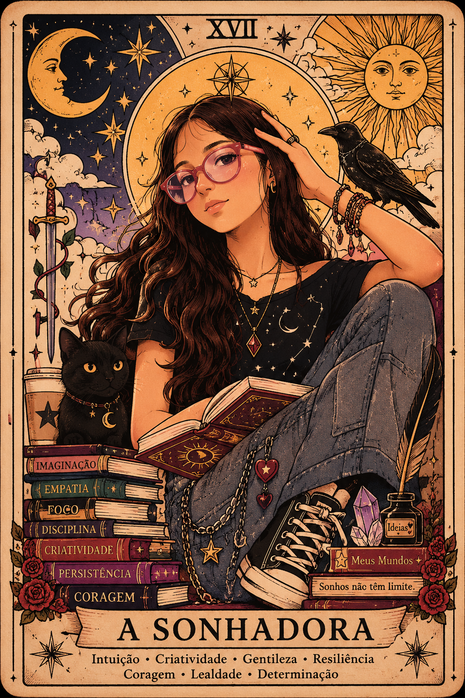

<div align="center">



# ✨ Aisha Faustino

### Jovem escritora • Criadora de mundos • Apaixonada por histórias


<br>

> “Sonhos não têm limites.”

</div>

---

## 🌙 Sobre mim

Olá! Eu sou Aisha Faustino, uma jovem escritora paraense apaixonada por leitura, fantasia, magia e criação de novos mundos.

Minha relação com a escrita começou de um jeito bem simples: eu pegava folhas de caderno, cortava para que parecessem pequenos livros e começava a criar personagens, cenários e histórias.

Com o tempo, aquelas pequenas páginas foram crescendo. Com o incentivo da minha família, passei a escrever no computador e comecei a transformar minhas ideias em projetos literários cada vez maiores.

Hoje, já concluí dois livros e estou trabalhando em uma nova história ambientada em uma escola de magia.

Também gosto muito de produção textual e já concluí formação pela Fundação Bradesco.

Este GitHub será um espaço para registrar alguns dos meus projetos, ideias, universos e experiências criativas.

---

## 📚 Meus livros

<table>
<tr>
<td width="33%" valign="top">

### 🏰 Um Amor Predestinado

Minha primeira história concluída.

Foi o projeto que transformou aqueles pequenos livros feitos com folhas de caderno em algo maior.

A história possui uma atmosfera medieval e representa o começo da minha jornada como escritora.

Status: Em preparação

</td>
<td width="33%" valign="top">

### 🔮 Arcane Academy

Meu segundo livro e uma etapa importante na evolução da minha escrita.

Uma história maior, com fantasia, aventura, personagens, surpresas e reviravoltas.

Status: Em preparação

</td>
<td width="33%" valign="top">

### ✨ Vanessa Doorman em Exside

#### Uma Escola de Magia

Meu projeto atual.

Vanessa é uma garota calma e tímida que viverá uma aventura em uma escola de magia repleta de mistérios, amizades, descobertas e segredos.

Status: Em desenvolvimento

</td>
</tr>
</table>

---

## 🪶 Minha jornada

```text
📖 Pequenos livros feitos com folhas de caderno
        ↓
🏰 Um Amor Predestinado
        ↓
💻 Comecei a escrever no computador
        ↓
🔮 Arcane Academy
        ↓
✨ Vanessa Doorman em Exside
        ↓
🌌 Muitos outros mundos ainda estão esperando para nascer...
```

---

## 💜 O que faz parte do meu universo

<div align="center">

| Imaginação | Criatividade | Empatia | Foco |
|:----------:|:------------:|:-------:|:----:|
| ✨ | 🎨 | 💜 | 🎯 |

| Disciplina | Persistência | Coragem | Sonhos |
|:----------:|:------------:|:-------:|:------:|
| 📚 | 🌙 | ⭐ | 🌌 |

</div>

---

## 🧙‍♀️ O que você vai encontrar por aqui

Este espaço poderá crescer junto comigo.

No futuro, quero compartilhar projetos relacionados a:

- 📖 meus livros e histórias;
- 🪄 personagens e universos;
- 🗺️ mapas de mundos fictícios;
- ✍️ experiências com escrita;
- 🧩 projetos criativos;
- 🎨 conceitos visuais;
- 📚 incentivo à leitura e à produção textual;
- 🌟 novidades sobre Exside.

---

## ✨ Atualmente

Estou trabalhando em:

### Vanessa Doorman em Exside: Uma Escola de Magia

Um novo universo de fantasia ambientado em uma escola de magia.

Ainda existem muitos personagens para conhecer, lugares para explorar e segredos para descobrir.

<div align="center">

`Em desenvolvimento...` ✍️ 🌙 ✨

</div>

---

## 🌷 Uma mensagem para quem também gosta de escrever

Você não precisa começar com uma história perfeita.

Às vezes, tudo começa com uma folha de papel, uma personagem, uma ideia e muita imaginação.

Continue escrevendo.

Os mundos que existem dentro de você só poderão ser conhecidos quando você decidir colocá-los no papel.

---

## 🛡️ Segurança e acompanhamento

Este perfil e os projetos públicos relacionados a Aisha Faustino são administrados e monitorados pelos pais/responsáveis legais.

Contatos, convites, entrevistas, projetos, eventos e futuras parcerias devem ser tratados exclusivamente com os responsáveis.

Não há canal de contato privado direto com Aisha por meio deste perfil.

---

<div align="center">

### 🌙 Aisha Faustino

Criando mundos, personagens e histórias.

🪶 `Imaginar → Escrever → Evoluir`

<br>

© 2026 Aisha Faustino  
Conteúdo literário e personagens reservados à autora.

</div>
